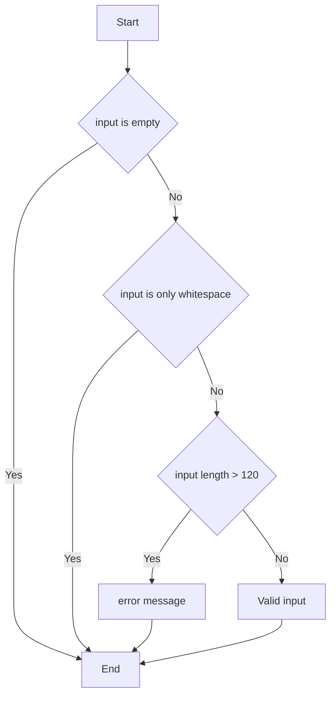

# Sơ đồ Validation

```text
version: 1.1
status : Draft → To be Frozen
```

# 1. Code - js
```js
function validation(input) {
    let validationMessage = document.querySelector(".validation-message");
    let message = "";    

    // TC-02: VAL-01: Bỏ trống nội dung
    if (input.length === 0) {
       return;
    }
    // TC-03: VAL-02: Nội dung chỉ có khoảng trắng
    if (input.trim().length === 0) {
       return;
    }
    // TC-04: VAL-03: Nội dung quá dài
    if (input.length > 120) {
        message += "TC-04: VAL-03: Nội dung quá dài \n";
    }

    validationMessage.innerText = message;
    taskInput.value = "";

    // Return false nếu có lỗi, true nếu hợp lệ
    return message.length === 0;
}
```

# 2. Mermaid Diagram
